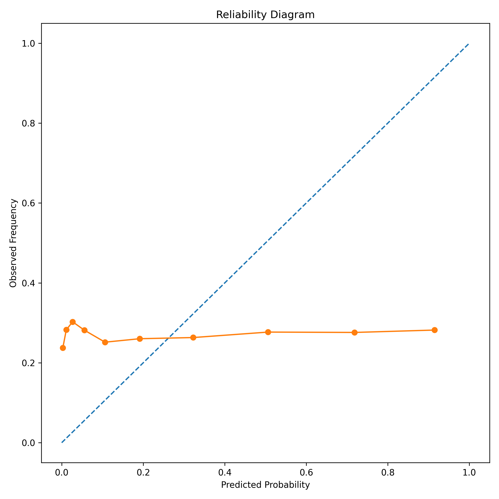
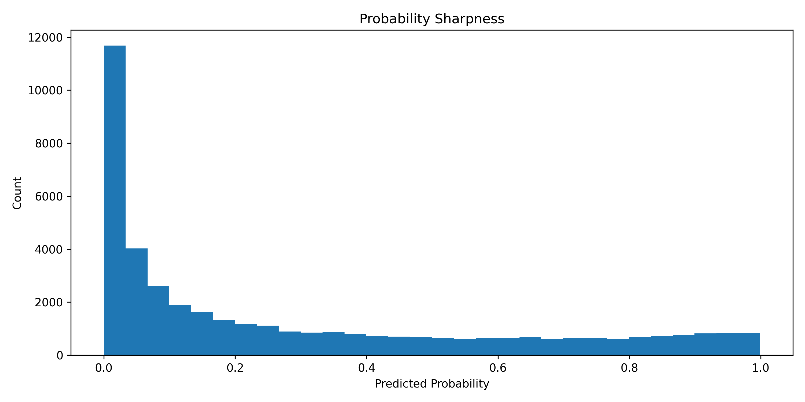
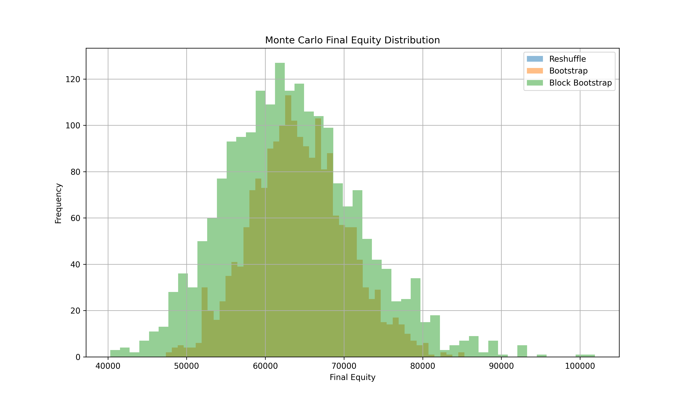
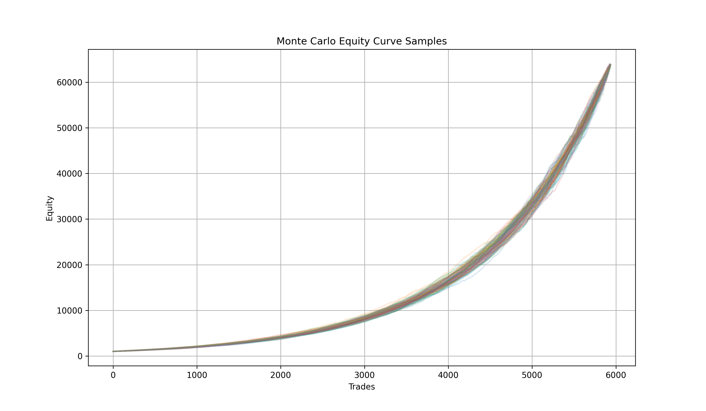

# Statistical Due Diligence

## Objective

Full institutional-grade statistical due diligence over the S4BTC engine before live deployment, leverage scaling, or external capital allocation. Source: statistics/README.md.

Questions this audit answers:

1. Does the strategy possess statistically significant edge?
2. Is the edge robust across regimes?
3. Is the system overfit?
4. Can the strategy survive realistic market frictions?
5. Is the edge scalable with leverage and sizing?
6. Can the edge survive randomized sanity tests?
7. Does the strategy exhibit conditional alpha or structural alpha?

## Baseline System Snapshot

Dataset: BTCUSDT 1H, ~33,140 observations, 2022-2026. Walk-forward: 180-day rolling train window, 14-day test step, EV-based trade selection, leverage-aware risk constraints.

| Metric | Value (per statistics/README.md) |
|---|---|
| Final Equity | $7,989 |
| Starting Equity | $1,000 |
| CAGR | ~72% |
| Winrate | 64.65% |
| Trades | 2,968 |
| Mean Accuracy | 61.63% |
| Mean F1 | 0.218 |
| Mean Precision | 0.286 |
| Mean Recall | 0.266 |
| Max Drawdown (Daily) | -2.04% |
| Max Drawdown (Intraday) | -2.14% |
| Worst Daily Return | -0.40% |

Note: these figures differ from walk_summary.json (a later run). See Appendix - Data Reconciliation. Flagged, not yet resolved.

## Priority 1 - Probability Calibration Audit

Objective: validate whether predicted probabilities correspond to realized outcomes: detect overconfidence, probability drift, threshold distortion, false certainty.

Files: calibration.py, calibration_table.csv, reliability_diagram.png, probability_sharpness.png, confidence_analysis.csv.

Finding: predicted probabilities were overconfident. High-confidence predictions did not translate into proportionally higher realized winrates; confidence bins clustered near 0.50.

| Avg Confidence | Realized Winrate |
|---|---|
| 0.49 | 0.23 |
| 0.47 | 0.30 |
| 0.45 | 0.28 |

{#fig-reliability width=80%}

{#fig-sharpness width=80%}

Recalibration study (s4_enhancement/probabilistic_recalibration.py):

| Model | Brier | LogLoss | F1 |
|---|---|---|---|
| RAW | 0.292 | 1.031 | 0.269 |
| ISOTONIC | 0.211 | 1.121 | 0.0005 |
| PLATT | 0.210 | 1.115 | 0.0000 |

Interpretation: recalibration improved Brier score and probability consistency, but destroyed F1 classification performance. Probabilities became statistically smoother but thresholds became invalid. Future work requires EV-aware thresholds, percentile thresholds, dynamic decision boundaries, calibration-aware walk-forward integration - not literal-probability thresholds.

## Priority 2 - Regime Segmentation

Objective: determine where the edge exists, where it disappears, when the strategy should deactivate.

Files: regime_segmentation.py, regime_volatility.csv, trend_regime_segmentation.py, trend_regime_report.csv, dma200_report.csv, regime_analysis.py, regime_report.csv.

Volatility regimes:

| Regime | Winrate | Avg Return |
|---|---|---|
| Q4_HIGH | 64.15% | 1.24% |
| Q3_MEDHIGH | 67.03% | 0.87% |
| Q2_MEDLOW | 63.55% | 0.59% |
| Q1_LOW | 64.45% | 0.36% |

Trend regimes:

| Regime | Winrate | Avg Return |
|---|---|---|
| BULL_TREND | 67.38% | 0.85% |
| BEAR_TREND | 64.08% | 0.74% |
| BULL_WEAK | 64.90% | 0.72% |
| BEAR_RALLY | 56.77% | 0.56% |

200 DMA regimes:

| Regime | Winrate |
|---|---|
| ABOVE_200DMA | 66.89% |
| BELOW_200DMA | 62.52% |

Interpretation: the system is not always-on alpha. It behaves as conditional regime alpha: best in bullish trend + above 200DMA + high volatility; worst in bear rallies. This motivated the meta-regime filtering research in Chapter 3.

## Priority 3 - Reality Modeling (Friction Stress Test)

Objective: stress-test the system under realistic trading conditions: spread widening, slippage expansion, liquidity degradation, execution friction.

Files: reality_modeling.py, reality_modeling_report.csv.

| Scenario | Outcome |
|---|---|
| BASELINE | Extremely profitable |
| LIGHT_FRICTION | Survived |
| MEDIUM_FRICTION | Survived |
| HEAVY_FRICTION | Survived |
| EXTREME_FRICTION | Collapsed |

Interpretation: the edge survives realistic execution friction and moderate liquidity degradation, but catastrophic friction destroys profitability. Execution quality remains critical.

## Priority 4 - Position Sizing Research

Objective: determine optimal leverage, Kelly sizing, volatility targeting feasibility.

Files: fractional_kelly_research.py, fractional_kelly_report.csv, vol_targeting_report.csv.

Full Kelly estimate: 0.505 - unusually high for a systematic trading system.

| Fraction | Max DD |
|---|---|
| 0.10 Kelly | -0.78% |
| 0.25 Kelly | -1.94% |
| 0.50 Kelly | -3.84% |
| 0.75 Kelly | -5.71% |
| 1.00 Kelly | -7.54% |

Interpretation: the system appears risk-scalable and leverage-tolerant, with Sharpe remaining approximately constant across leverage scaling (near-linear behavior under scaling) - atypical for overfit systems. Full Kelly introduces unnecessary volatility; fractional Kelly dramatically improves survivability.

## Priority 5 - Randomized Label Sanity Check

Objective: determine whether the model extracts genuine signal or exploits noise.

Files: randomized_labels_sanity.py, randomized_labels_report.csv.

| Metric | Value |
|---|---|
| Mean Accuracy | 72.9% |
| Mean Precision | 0.044 |
| Mean Recall | 0.009 |
| Mean F1 | 0.014 |

Interpretation: when labels were randomized, predictive quality collapsed (F1 near-vanished, recall disappeared). Strong evidence the original model is not simply memorizing noise. High accuracy under randomization is a base-rate artifact (class imbalance), not a signal - F1/recall are the diagnostic metrics here.

## Priority 6 - Trade Dependency Analysis

Objective: study clustering, path dependency, serial correlation, streak behavior.

Files: trade_dependency_analysis.py, trade_dependency_report.csv.

| Metric | Value |
|---|---|
| Global Winrate | 64.79% |
| Avg Win Streak | 17.94 |
| Max Win Streak | 120 |
| Avg Loss Streak | 9.75 |
| Max Loss Streak | 52 |
| Lag-1 Autocorrelation | 0.851 |

Interpretation: trades exhibit significant clustering, non-random sequencing, and persistent market-state behavior - further support for regime dependence and structural conditional alpha (rather than i.i.d. edge).

## Priority 7 - White's Reality Check / SPA

Objective: test whether the observed edge survives multiple-testing bias and data-snooping concerns.

Files: whites_reality_check.py, whites_reality_check_report.csv.

| Metric | Value |
|---|---|
| Observed Mean Return | 0.007652 |
| Std Return | 0.011966 |
| Sharpe-like | 0.6395 |
| White RC p-value | 0.506 (FAIL) |
| SPA Sign-Flip p-value | 0.000 (PASS) |

Interpretation - mixed result. White's Reality Check fails (p=0.506), suggesting possible sensitivity to data-mining bias when benchmarked against a large universe of alternatives. The SPA sign-flip approximation passes (p=0.000). This is not definitive proof of edge, but also not a rejection. See Chapter 3 for the regime-conditional SPA re-analysis (BEAR/LATERAL/BULL, all p=0.000 vs buy-and-hold), which explains the global White RC failure as a benchmark-selection artifact (buy-and-hold in BTC's strongest historical bull run), not model data-snooping.

## Feature Significance / Stability

Objective: measure feature importance, stability, overfit indicators.

Files: feature_significance.py, feature_significance_full.csv, feature_significance_summary.csv.

Initial finding (XGBoost gain/cover importance): most features displayed unstable importance - volume, MACD derivatives, EMA structures, RSI, ATR all highly unstable. Interpretation: edge may emerge from feature interaction, not single dominant predictors; possible regime dependence; possible need for adaptive models.

Superseding finding (SHAP stability, later session - see Chapter 4): using SHAP instead of XGBoost gain/cover (methodologically superior - SHAP measures actual contribution to output), all features show CV < 0.5 (stability threshold):

| Feature | CV | Status |
|---|---|---|
| macd_diff | 0.169 | STABLE |
| rsi_14 | 0.272 | STABLE |
| atr | 0.275 | STABLE |
| macd | 0.352 | STABLE |
| macd_signal | 0.359 | STABLE |
| ema_10 | 0.373 | STABLE |
| ema_30 | 0.419 | STABLE |

Ranking by average importance: ema_30 (0.0947, structural anchor) > atr (0.0334) > macd (0.0279) > ema_10 (0.0229) > macd_diff (0.0177) > rsi_14 (0.0126) > macd_signal (0.0084). Notable event: ema_30 importance drops from 0.1005 to 0.0224 in Nov 2024 (post-election ATH breakout), with rsi_14 compensating - interpreted as healthy model adaptation, not fragility.

Note: the original (unstable) finding used XGBoost gain/cover; the later SHAP analysis supersedes it methodologically. Both are kept here since they come from different research sessions and use different feature sets - flagged for reconciliation in the Appendix.

## Monte Carlo Analysis

Objective: stress-test return distribution robustness: path variability, probabilistic survivability, drawdown robustness, compounding stability.

Files: montecarlo.py, montecarlo_results.csv, montecarlo_distribution.png, montecarlo_equity_curves.png.

Three methods run: reshuffle, bootstrap, block bootstrap. Sample of results (final equity from $1,000 start, 4 runs shown):

| Method | Sample Final Equity Range |
|---|---|
| Reshuffle | ~$63,826 (constant across runs - deterministic reshuffle of fixed trade set) |
| Bootstrap | $56,253 - $65,236 |
| Block Bootstrap | $50,050 - $92,153 |

{#fig-mc-dist width=90%}

{#fig-mc-equity width=90%}

Note: these figures are approximately 8x larger than the walk-forward baseline equity ($7,989-$8,590 depending on source). This suggests the Monte Carlo in statistics/ may be running over a different (possibly longer or unfiltered) trade set than the walk-forward baseline - flagged in the Appendix for reconciliation, not yet explained.

## Final Conclusions (per statistics/README.md)

The audit strongly suggests the system likely possesses genuine conditional edge:

- survives randomized labels,
- survives realistic friction,
- improves coherently under favorable regimes,
- displays structured clustering,
- remains profitable under leverage scaling.

However, the system is not yet production-grade. Remaining critical tasks: live shadow deployment, calibration-aware walk-forward, dynamic thresholds, funding/perp features, microstructure signals, order-flow integration, live execution validation (see Chapter 6 - Roadmap).

Current classification: "Research-grade promising systematic strategy" - not yet institutional production system, but substantially beyond hobby backtesting.
