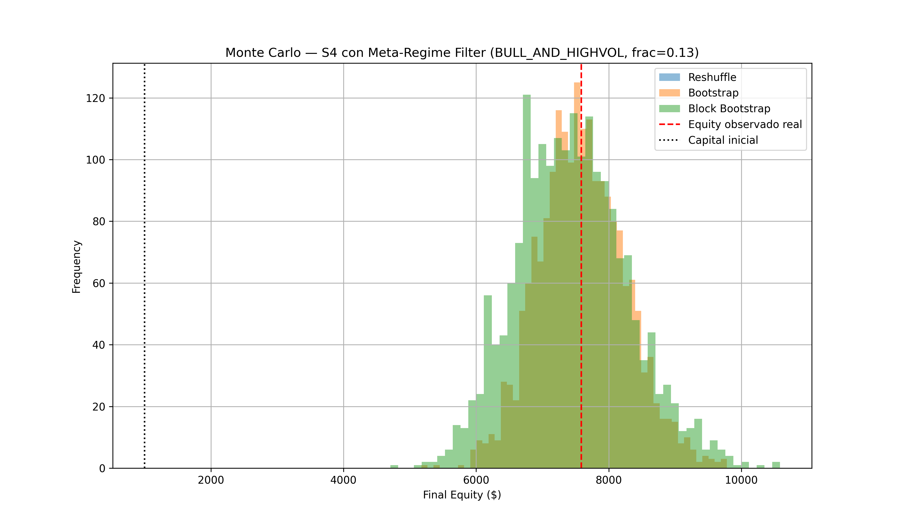
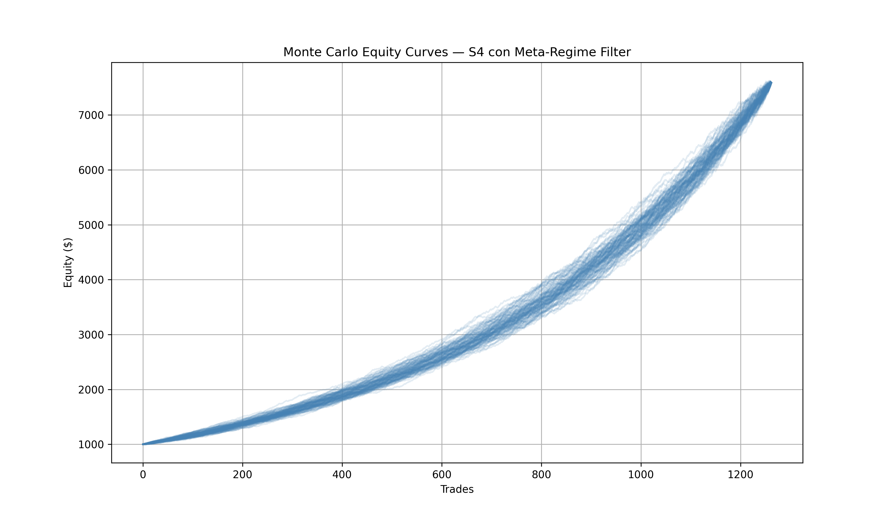

# Regime Research

## Critical Discovery: The Edge is Not Uniform

The strategy behaves more like a regime exploitation engine than a universally profitable system.

S4BTC is strongest during: bullish trend persistence, elevated volatility expansion, high directional continuation.
S4BTC weakens during: bear rallies, unstable reversals, sideways compression.

Source: s4_enhancement/README.md.

## Meta-Regime Filter: BULL_AND_HIGHVOL

Definition:

~~~
trend_regime == BULL_TREND  (close > ema_50 AND close > dma_200)
vol_q in top 50% of atr_pct (rolling causal window)
~~~

Integrated meta-regime walk result vs. baseline:

| Metric | Baseline | BULL_AND_HIGHVOL Filter |
|---|---|---|
| Winrate | 64.79% | 72.61% |
| Sharpe-like | 0.6395 | 0.8534 |
| Max Drawdown | -14.42% | -7.40% |
| Trades | (full set) | 1,727 |

Other filter variants tested: ONLY_ABOVE_200DMA - Sharpe 0.7123, Max DD -8.52%, Winrate 66.89% (weaker than BULL_AND_HIGHVOL).

Validated across 5 independent layers of evidence (per s4_enhancement/montecarlo_regime_filter/README_META_REGIME_VALIDATION.md): walk-forward causal, position sizing, Monte Carlo, SPA, and retroactive test against the 30 real live-trading days (see Chapter 4).

{#fig-mc-dist-regime width=90%}

{#fig-mc-equity-regime width=90%}

## Kelly Fraction Research (Phase 3)

Rationale: once regime filtering improved stability, position sizing became the next optimization target - determine optimal leverage, volatility targeting, safe fractional Kelly deployment.

| Fraction | Drawdown |
|---|---|
| 1.00 Kelly | -7.54% |
| 0.75 Kelly | -5.71% |
| 0.50 Kelly | -3.84% |
| 0.25 Kelly | -1.94% |
| 0.10 Kelly | -0.78% |

Important discovery: Sharpe remained approximately constant across leverage scaling - the system behaves near-linearly under scaling. This is favorable, but full Kelly introduces unnecessary volatility; fractional Kelly dramatically improves survivability.

Production candidate (recommended research direction): regime filter (ONLY_BULL_TREND or BULL_AND_HIGHVOL) combined with 0.25-0.50 Kelly and volatility targeting.

## The 16-Cell Regime Matrix - Tested and Rejected

A full 4x4 matrix (4 trend categories x 4 volatility quartiles = 16 regimes) was investigated with an anti-data-snooping protocol: fixed temporal design/validation split (design 2022-2024, frozen OOS validation 2025-Apr 2026), direction determined by actual model p_up (not oracle/look-ahead label), and pre-registered minimum sample size per cell.

Methodological correction during this research: an early calculation used np.maximum(ret_long, ret_short) - the best of both directions - which guarantees 100% winrate by construction (oracle result, not a real model signal). This was corrected to use the direction the model would actually predict (p_up >= 0.5 -> long).

Design results (top 5 cells by Sharpe):

| Trend | Vol | n | Winrate | Sharpe |
|---|---|---|---|---|
| BULL_WEAK | HIGH_VOL | 425 | 0.831 | 1.049 |
| BEAR_TREND | HIGH_VOL | 2,497 | 0.795 | 0.898 |
| BULL_WEAK | MIDHIGH_VOL | 592 | 0.752 | 0.871 |
| BEAR_RALLY | HIGH_VOL | 406 | 0.759 | 0.867 |
| BULL_WEAK | MIDLOW_VOL | 741 | 0.738 | 0.827 |

Notably, BULL_TREND + HIGH_VOL (the filter deployed in production) ranks only 10th of 16 in this design set (Sharpe 0.715) - contradicting the original research premise that bull trend specifically was the favorable condition. HIGH_VOL alone appears to dominate, independent of trend direction.

Out-of-sample validation (2025-Apr 2026): all 16 cells survived with positive Sharpe (range 0.615-1.005). This uniform survival is itself the red flag: it indicates the partition is not discriminating anything real - the unfiltered base model already achieves Sharpe approximately 0.75 (0.7456, winrate 74.70%, n=10,262) across essentially any regime combination measured this way, and this figure falls exactly at the center of the per-cell Sharpe range.

Decision: the 16-cell matrix was rejected as a system enhancement in its current form. Source: RESULTADO_MATRIZ_Y_CAUSA_30DIAS.md.

## Why Regime Classification Is Unstable on 1h Candles

Measured over the full dataset (33,140 1h candles, 2022-2026):

| Metric | Value |
|---|---|
| Regime changes per week | 17.19 |
| Median streak duration | 3 hours |
| % of streaks < 6 hours | 65.0% |
| % of streaks > 1 week | 0.1% |

Testing slower EMAs (50/100/150/200) did not resolve this - median streak stayed 2-3 hours regardless. Conclusion: the problem is timescale, not indicator speed. Real BTC cycles (bear from Sept 2025, bull Apr-Sept 2025, bull 2023-2025) last months, not measurable on 1h candles.

Daily-candle validation (DMA=100d, EMA=50d) does show real long streaks (e.g., 28 Oct 2025-5 Jan 2026: 69 continuous days BEAR_TREND), but without smoothing, median streak is still only 2 days (69.2% of streaks < 1 week) - short-term noise mixed with real macro-regime signal.

With majority-vote smoothing over N days:

| Confirmation window | Median streak | % streaks < 7d | % streaks > 30d |
|---|---|---|---|
| No smoothing | 2 days | 69.2% | 10.5% |
| 5 days | 9 days | 39.7% | 23.8% |
| 7 days | 12 days | 32.1% | 28.3% |
| 10 days | 14 days | 22.7% | 36.4% |
| 14 days | 17 days | 24.4% | 43.9% |

10-14 day smoothing produces stable, real regimes - but at the cost of ~2 weeks of detection lag, which historically is where the best part of a new move's return occurs. This is a structural trade-off, not solved by parameter tuning: more stability = less reaction speed.

## Decision (26 Jun 2026)

Kept: BULL_AND_HIGHVOL as the sole regime filter for production, given its 5-layer validation and lowest available risk.

Rejected for now: the full multi-regime "gearbox" (including a BEAR_AND_HIGHVOL leg) - the honest validation cost (daily-scale, 10-14 day smoothing, sample reduction from 33,140 to ~1,580 daily observations, multiple-comparison correction) exceeded available session time, and the session had already demonstrated the cost of building on unverified results (Monte Carlo bugs, mixed methodologies, contaminated ledger files).

Parked as non-blocking parallel research: repeat the matrix at daily scale with 10-14 day smoothing; apply the anti-data-snooping protocol; specifically validate BEAR_AND_HIGHVOL with the same 5-layer methodology; if validated, combine filters (OR logic) and re-run the retroactive test against the 30 real paper-trading days.

Source: s4_enhancement/README_REGIME_MATRIX_DECISION.md.
