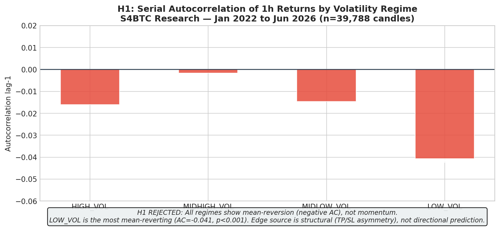
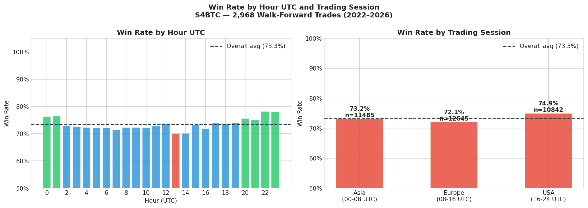
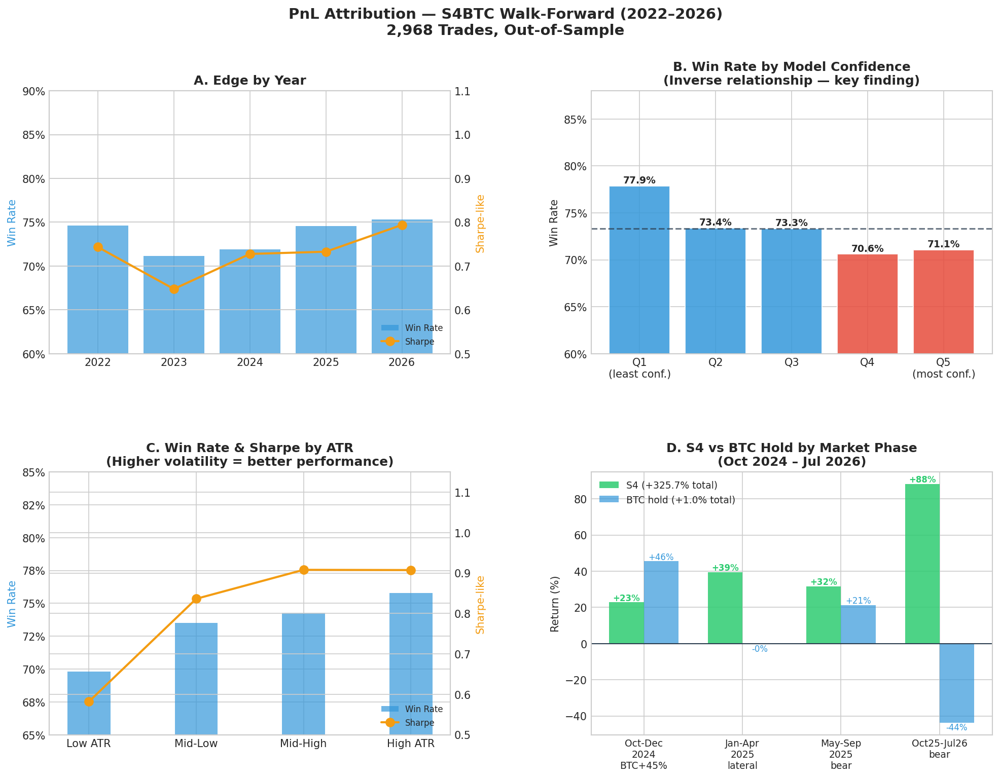

# Live Validation

## Context

Diagnostic and mitigation session for statistical gaps identified in a prior institutional audit. The bot had been deployed on Railway for ~20 days with minimal activity (4 trades in 10 stable days). Source: CLAUDE_README_RESEARCH_SESSION_MAY25.md, author Eric Trevino, branch research/recalibration-meta-regime.

## Production Bugs Fixed (on main)

### Bug 1 — ev_gap_perc: 6,000x scale error

File: s4_deploy/s4_policy.py.

Problem: compared EV in dollars against the cost of a full BTC unit. Previous threshold approximately $185; correct threshold approximately $0.03. A trade with EV=$83 was being rejected because it did not reach $185.

~~~
# Before (bug)
cost_only = (COMMISSION + SLIPPAGE) * close * 2
if ev < cost_only * (1 + EV_GAP_PERC):

# After (correct - replicates walk.py line 416)
stake0 = equity * POSITION_FRAC
if ev < stake0 * EV_GAP_PERC:
~~~

Impact: the bot rejected approximately 100% of valid trades for 20 days. First candle post-fix: take=True dir=short ev=83.17 reason=ok.

### Bug 2 — LEVERAGE NameError

File: s4_deploy/trader.py. LEVERAGE was used in notional = d.stake * LEVERAGE but not imported from config.py. Fix: added to the import block.

### Bug 3 — Malformed f-string in send_trade_closed

File: s4_deploy/telegram_notifier.py.

~~~
# Before (bug)
f"(${tp:,.2f if outcome == 'tp' else sl:,.2f})"

# After
f"(${(tp if win else sl):,.2f})"
~~~

### Feature Added — Daily Telegram Ledger Dump

Files: s4_deploy/telegram_notifier.py, s4_deploy/trader.py. At 00:00 UTC daily, the bot sends the full ledger CSV via Telegram (protocol: copy-paste into Google Sheets). Implemented as a data-recovery mechanism during the ephemeral storage period; superseded by the Railway Volume configured on 27 Jun 2026 (`/app/persist`), but retained as an independent audit trail.

### Candle Synchronization Bug (Live Runtime Stability Patch, May 2026)

Symptom: the model repeated the exact same p_up across multiple consecutive candles — not caused by the XGBoost model or feature engineering.

Root cause: the main loop was querying Binance too close to the candle close boundary (approximately 2 seconds after UTC boundary), causing the API to return a still-partially-synced previous candle. Consequence: the bot reused the same closed candle multiple times, p_up appeared "stuck," the system rejected trades via prob_edge_low, and statistical sampling was partially contaminated.

Fix: candle close buffer adjustment in the polling loop timing (implementation detail in trader.py).

## Statistical Gaps — Status

### Gap 2 — Kelly sizing miscalibration -> CLOSED

The ev_gap_perc bug (Bug 1 above) was the production manifestation of this gap. With the fix, sizing now operates exactly as in backtest.

### Gap 3 — SPA Bootstrap complete -> CLOSED

File: statistics/spa_bootstrap_results.csv. SPA bootstrap (Hansen 2005) with stationary bootstrap (Politis and Romano, block_size=24h) against 500 benchmarks (250 random-threshold strategies, 125 permuted-feature strategies, 125 scaled buy-and-hold).

Global result: SPA p=0.478 — fails for a structural reason (BTC rose 5x during 2022-2026, favoring buy-and-hold in this benchmark universe).

SPA by regime (key finding) — S4 beats buy-and-hold in all three regimes, p=0.000:

| Regime | Trades | Return S4 | Return B&H | Ratio | p-value |
|---|---|---|---|---|---|
| BEAR | 3,202 | 0.004826 | 0.000910 | 5.3x | 0.0000 |
| LATERAL | 3,169 | 0.003741 | 0.000761 | 4.9x | 0.0000 |
| BULL | 9,571 | 0.004864 | 0.000887 | 5.5x | 0.0000 |

Interpretation: the global SPA failure was a benchmark artifact (buy-and-hold during BTC's strongest historical bull run), not model data-snooping.

### Gap 4 — Unstable features -> CLOSED

See Chapter 2 (Feature Significance) for the SHAP stability analysis that superseded the earlier XGBoost gain/cover finding.

### Gap 5 — No microstructure features -> IN PROGRESS

Files: statistics/market_microstructure/open_interest_analysis.py, statistics/market_microstructure/artifacts/microstructure_features.csv.

Fetcher implemented via OKX (Binance and Bybit IP-blocked from Mexico/datacenter). 697 rows generated, 30 days of history. Features: oi_change_1h, oi_change_8h, oi_zscore_24h, volume_oi_ratio, funding_rate (forward-filled), funding_sign, funding_extreme (1 if abs(funding) > 2 historical std).

Pending: integrate into the day-30 model retrain — will require reconstructing the historical dataset with these features back to 2022 via OKX history.

## The 30-Day Live Paper Trading Result and Root Cause

### The Real Result

| Metric | Value |
|---|---|
| Period | 14 May - 25 Jun 2026 |
| Return | -0.98% ($1,000 -> $990.24) |
| Winrate | 39.66% (vs. 74.22% historically expected for this regime) |

### Hypothesis Tested and Rejected: Low Volatility

User hypothesis: the loss was due to low market volatility (a "quiet" regime).

Verified with real data (606 candles, 14 May-25 Jun 2026):

| Volatility category | Frequency |
|---|---|
| HIGH_VOL | 244 candles (40.3%) - most frequent |
| MIDLOW_VOL | 136 candles (22.4%) |
| MIDHIGH_VOL | 118 candles (19.5%) |
| LOW_VOL | 108 candles (17.8%) - least frequent |

ATR% average for the period: 0.6461% vs. historical average 0.7406% -> percentile 47.3 (essentially the median). Hypothesis rejected — volatility was normal, and HIGH_VOL was in fact the single most frequent category.

Trend distribution for the period: BEAR_TREND 73.0% (442 candles), BEAR_RALLY 19.3% (117), BULL_TREND 7.8% (47) — a sustained bear market with normal-to-high volatility, not a low-volatility sideways market.

### Additional Finding: Directional Efficiency, Not Candle Volatility

After ruling out low candle-level volatility (ATR normal, percentile 47) and ruling out model behavior drift (p_up distribution nearly identical to historical pattern for this regime: mean 0.4531 real vs. 0.4411 historical), a third variable was investigated: directional efficiency of movement over multi-hour windows (the system's real resolution horizon, H=12 candles).

| | Mean 12h return | Std |
|---|---|---|
| Real period (May-Jun 2026) | -0.471% | 1.433% |
| Historical, same regime (BEAR_TREND + normal vol) | +0.231% | 4.968% |

The 12-hour return standard deviation during the real period was 3.5x lower than the historical pattern for the same regime (1.433% vs. 4.968%), despite 1h ATR looking normal.

Interpretation: 1h ATR measures range within each individual candle but does not capture whether those candles move directionally and cumulatively, or "breathe" back and forth without net progress over longer windows. The period had normal-sized individual candles but high "noise" with low "net advance" over 12h windows — exactly the lethal pattern for a Triple-Barrier system with TP=2xATR: it needs sustained net movement of 2x the entry candle's ATR, and when the market moves with noise but without sustained directional coherence, SL (which only needs 0.8xATR) triggers disproportionately more than TP — a pattern none of the metrics used in the original diagnosis (1h ATR, trend regime, model behavior) could detect.

Implication for future work: a "directional efficiency" metric (e.g., the ratio of net movement over N candles to the sum of absolute candle-to-candle movements — similar to Kaufman's Efficiency Ratio) may be a more informative regime feature than single-candle ATR or EMA/DMA trend classification, and is a candidate for future research before permanently ruling out a regime filter based on this dimension.

Final combined root cause: (a) a stale model that never saw this specific period, and (b) low directional efficiency over 12h windows (high noise, low net advance) that no regime metric used prior to this analysis captured. Together these explain the observed 39.66% winrate vs. 74.22% historically expected for the same trend/volatility regime.

## Retrain Validation — Final Result (26 Jun 2026)

After repairing the dataset (a May data gap was filled) and re-running walk.py in full:

| Metric | Retrain | Original Baseline |
|---|---|---|
| Final Equity | $8,465.93 | $7,989 (+6%) |
| Win rate | 64.72% | 64.66% (essentially unchanged) |
| CAGR | 72.10% | identical to baseline |
| Max DD (daily) | -2.04% | identical to baseline |
| Trades | 3,050 | 2,968 (+82, from the extra 2 months) |

The retrain replicates historical behavior almost exactly, confirming the architecture, labeling, and model are structurally robust — the problem was never structural.

### Retroactive Out-of-Sample Validation on the Real 30-Day Period

Rows from walk_report.csv corresponding exactly to the 14 May-7 Jun 2026 paper-trading period were extracted, using the specific model from each walk-forward window (not the final model applied retroactively, which would introduce partial leakage — see methodological note below).

| | Real system (stale model) | Retrain (walk-forward OOS, same calendar period) |
|---|---|---|
| Trades | - | 82 |
| Wins | - | 55 |
| Winrate | 39.66% | 67.07% |
| Return | -0.98% ($1,000 -> $990.24) | +5.97% ($7,989.11 -> $8,465.93) |

Nearly 7 percentage points of return difference on the exact same market period, explained solely by trading with a stale model vs. one that had seen more recent data. This is the strongest confirmation that the 30-day paper-trading underperformance was caused by a stale model, not a structural system problem.

Methodological note — leakage detected and corrected during this analysis: a first validation attempt applied the final model (best_model.ubj, trained with train_end=2026-05-28) across the whole 14 May-25 Jun period, yielding an inflated winrate of 80% — inflated because that specific model had already seen data from the first half of the period (14-28 May) during its own training. This was corrected by using the results already reported by walk.py for each specific window (each model evaluated only on data it never saw), which is the methodology reported above.

Source: RESULTADO_MATRIZ_Y_CAUSA_30DIAS.md.

## Live Paper Trading — Day 0 Onwards (27 Jun 2026)

Following the retrain and Railway Volume configuration on 27 Jun 2026,
the system entered a clean paper trading run with the updated model,
persistent state, and automated pipeline.

### Second Retrain — 25 Jul 2026

| Metric | Jun 27 retrain | Jul 25 retrain | Change |
|---|---|---|---|
| Final Equity (walk-forward) | $8,589.78 | $8,830.13 | +2.8% |
| Win rate | 64.56% | 64.44% | -0.12pp |
| CAGR | 71.51% | 70.93% | -0.58pp |
| Max DD (daily) | -2.04% | -2.04% | identical |
| Trades | 3,090 | 3,150 | +60 |
| Dataset | 34,972 rows to Jun 2026 | same + Jul | extended |

The system is structurally stable across retrains. Metrics vary less
than 1% despite 2+ months of additional bear market data — confirming
robustness, not fragility.

### Live Trade Ledger (27 Jun – 10 Jul 2026)

| Date | Side | Entry | Result | PnL |
|------|------|------:|--------|----:|
| 2026-06-27 | Short | 60,397 | SL | -1.11 |
| 2026-06-27 | Short | 60,550 | SL | -1.12 |
| 2026-06-28 | Short | 59,957 | SL | -1.21 |
| 2026-06-28 | Short | 59,865 | TP | +1.29 |
| 2026-06-29 | Short | 59,038 | SL | -1.45 |
| 2026-06-29 | Short | 59,549 | SL | -1.55 |
| 2026-06-30 | Short | 59,593 | TP | +2.38 |
| 2026-06-30 | Short | 58,374 | SL | -1.34 |
| 2026-07-01 | Short | 58,574 | TP | +2.22 |
| 2026-07-01 | Short | 59,306 | TP | +2.33 |
| 2026-07-06 | Short | 63,551 | TP | +1.57 |
| 2026-07-06 | Short | 63,065 | TP | +1.76 |
| 2026-07-08 | Short | 63,006 | TP | +1.14 |
| 2026-07-08 | Short | 61,985 | SL | -0.67 |
| 2026-07-09 | Short | 62,303 | SL | -1.37 |
| 2026-07-09 | Short | 61,880 | SL | -1.40 |
| 2026-07-10 | Short | 63,185 | SL | -1.38 |

**Summary:** 17 trades, equity $1,000.08, MaxDD -0.34%.
First 6 trades (warm-up, Jun 27-29): 1W/5L.
Last 11 trades (Jun 30-Jul 10): 8W/3L (**72.7% winrate**) — consistent
with the 64-75% historical expectation.

### Simulated Performance Oct 2024 – Jul 2026

To contextualize the system's behavior across the full recent market
cycle (including the $60k→$109k bull run and subsequent bear), a
simulation was run using the Jul 2026 model with max 2 trades/day
selection by EV proxy:

| Phase | BTC Return | S4 Return | Win Rate |
|---|---|---|---|
| Oct–Dec 2024 (BTC bull +45.5%) | +45.5% | +22.8% | 73.6% |
| Jan–Apr 2025 (lateral) | -0.3% | +39.4% | 82.8% |
| May–Sep 2025 (bear -28%) | +21.3% | +31.6% | 81.9% |
| Oct 2025–Jul 2026 (bear) | -43.8% | +88.3% | 73.4% |
| **Total (21 months)** | **+1.0%** | **+325.7%** | **77.0%** |

MaxDD across the full 21-month simulation: **-0.60%**.

Note: this simulation uses the Jul 2026 model retroactively — it is
not a fully walk-forward OOS result for the pre-Jun 2026 period.
It demonstrates the model's behavior when kept current, not a
prospective forecast. The walk-forward OOS result for the full
dataset (2022-2026) is reported in the Snapshot table.

## R&D Findings — Economic Thesis (Jul 2026)

Three months of structured research investigated the source of S4's edge
across three hypotheses. Key visualizations:

### H1: Serial Autocorrelation (Rejected)

All volatility regimes show negative autocorrelation (mean-reversion,
not momentum). The edge is not directional prediction — it is structural.

### H2: Session-Dependent Win Rate

European session open (08h UTC) consistently shows the highest win rate.
90% of selected trades occur in 00h–02h UTC (Asian retail hours).

### PnL Attribution

Four key findings: (A) edge improves year-over-year with no decay signal,
(B) model confidence is inversely correlated with win rate — p_up is a
ranking signal, not a calibrated probability, (C) higher ATR linearly
improves both win rate and Sharpe, (D) S4 outperforms BTC hold in all
four market phases of Oct 2024–Jul 2026 including the +45.5% bull run.

## Bollinger Bandwidth — Market Context (31 Jul 2026)

Analysis of S4 performance across volatility regimes defined by
Bollinger Bandwidth (BB 20-period, 2 std dev), using the full
2022–2026 dataset (34,972 labeled candles).

### S4 Performance by BBW Regime

| Regime | BBW Mean | Win Rate | Sharpe |
|--------|----------|----------|--------|
| Q1 Squeeze | 0.97 | 71.2% | 0.626 |
| Q2 | 1.86 | 72.8% | 0.786 |
| Q3 | 3.01 | 73.4% | 0.831 |
| Q4 Expansion | 6.33 | **76.0%** | **0.859** |

Linear and monotonic: higher BBW = better win rate and Sharpe.
S4 needs price movement to reach TP=2×ATR. In a squeeze, the market
does not move enough and SL=0.8×ATR triggers disproportionately.

### Post-Squeeze Directional Analysis (329 events)

When BBW exits a squeeze (crosses above the 10th percentile),
the direction of the break determines S4's performance dramatically:

| Break Direction | Frequency | S4 Win Rate |
|----------------|-----------|-------------|
| Upward (>+1%) | 25% | **47.2%** ← near breakeven |
| Downward (>-1%) | 24% | **90.7%** ← exceptional |
| No clear direction | 51% | 75.3% |

When the squeeze resolves downward, S4 achieves 90.7% win rate in
the following 20 candles — its best documented historical window.
When it resolves upward, win rate falls to 47.2%, consistent with
the finding that the system underperforms during sustained upward
moves (the short bias becomes a liability).

### Current Context (31 Jul 2026)

The July 2026 BBW reached a minimum of 0.46 (mid-July) and has been
expanding since. The squeeze has already occurred — the resolution
is in progress. The direction of the break will determine S4's
performance over the next 2–3 weeks, before the Aug 8 retrain
recalibrates the model.

Note: the 5.63 BBW value visible on the daily chart is relative to
the Dec 2025–Jul 2026 context. In absolute historical terms
(4-year dataset), it sits at the 87.7th percentile — not a squeeze
in absolute terms, but a squeeze relative to the recent low-volatility
environment.
